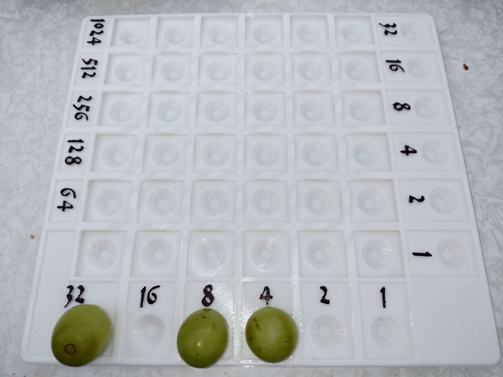
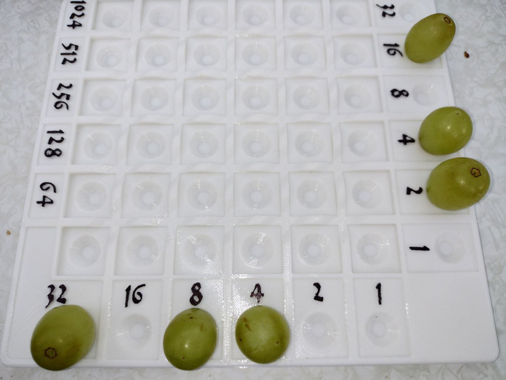
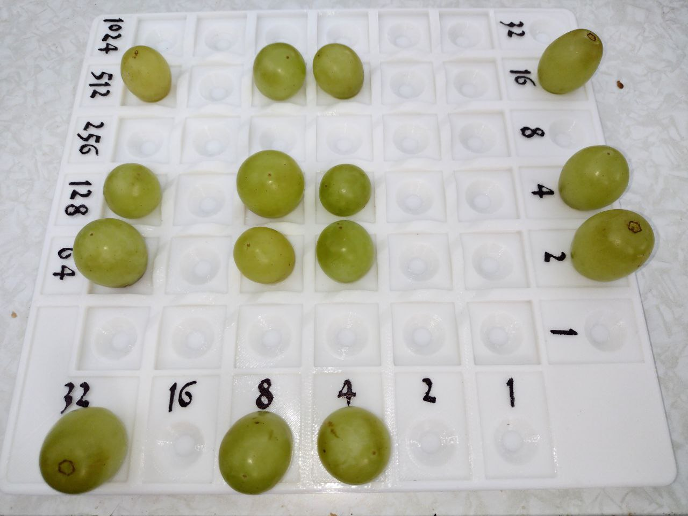
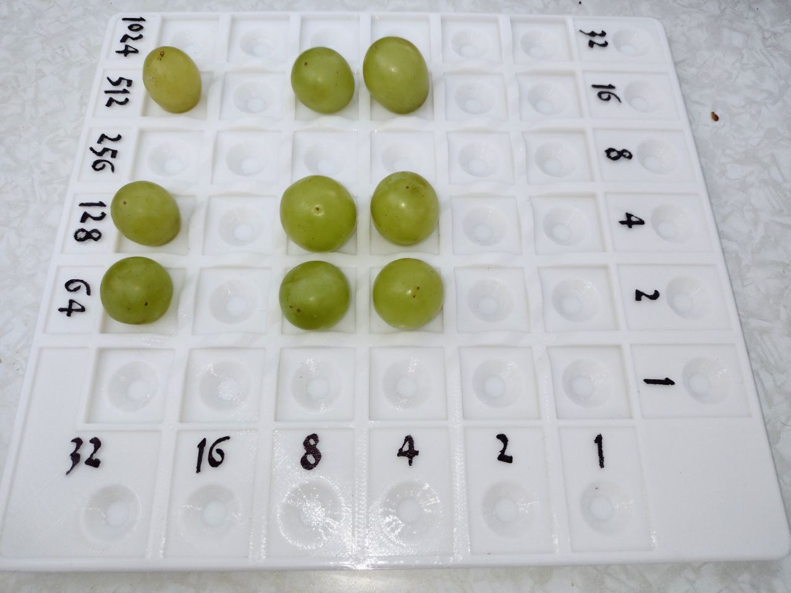
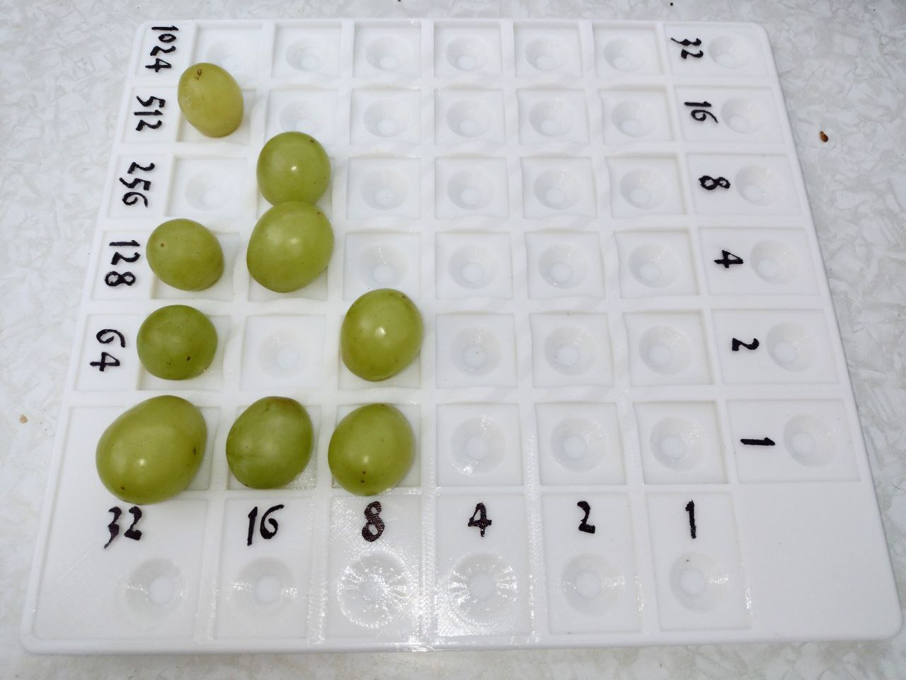
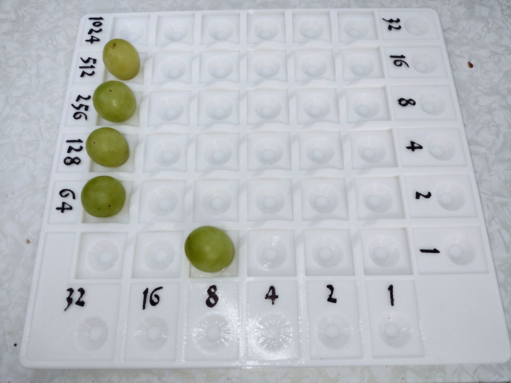

# Napier Binary Multiplication Board

1617 John Napier described three practical tools for doing math in his book "Rabdology".
One of them is a board that helps with the multiplication of binary numbers.
(This was well before Leibniz "officially" invented the binary system in 1676)

Here is a 3D printable version of the board, best used with with standard 16mm marbles.
It also somewhat works with grapes.

This version of the board consist of a 6 x 6 grid with numbers on the left, bottom and right margin.
At the bottom margin (below the numbers) there is an extra row used only for input.
At the right margin (beyond the numbers) there is an extra column to hold the second input number to multiply with.

### Properties of the board

The board has several interesting and also quite intuitive properties, concerning movement of grapes (or marbles) on the board.
- Imagine, we place a grape on the intersection of row 8 and column 4, this grape represents value 8*4 = 32
- Moving one row up or down will double or half its value.
- Same for moving left or right. This will also double or half the value.
- Thus, moving diagonally left & down does not change the value at all: It gets halved and doubled at the same time, the changes cancel out each other.
- Same for moving in the other direction on the same diagonal: The value remains. Any movement along e.G. (32,1) - (16,2) - (8,4) - (4,8) - (2,16) - (1,32) retains the value.
- When moved along the diagonal until it hits the bottom row (or left most column) the value becomes obvious: It is the number on the margin.
- (Movement along the other diagonal would multiply by 4 or divide by four, we don't use that property)

### Example Multiplication: 44 x 22

The first number (44) is entered in the lower margin as 101100 (from left to right) - a grape represents a 1, an empty field represents 0.

The second number (22) is entered in the right hand margin as 010110 (from top to bottom).

Whenever a row with a grape intersects a column with a grape, place a grape onto the grid.

We can remove the "input" from the margins now.

Move all grapes diagonally left & down until they hit the margin or collide with another grape.

To resolve collisions:
- Move diagonally into the occupied space, holding the second grape on top of the other one.
- Discard (eat) one of the grapes **and** move the other one upwards to the next free space.
- After doing this with all collisions, there may be some new grapes that are not at the bottom or left row of the board.

Now we can read the result in binary 01111001000 notation
and convert it back to decimal: 512 + 256 + 128 + 64 + 8 = 968

https://www.thingiverse.com/thing:6762793
